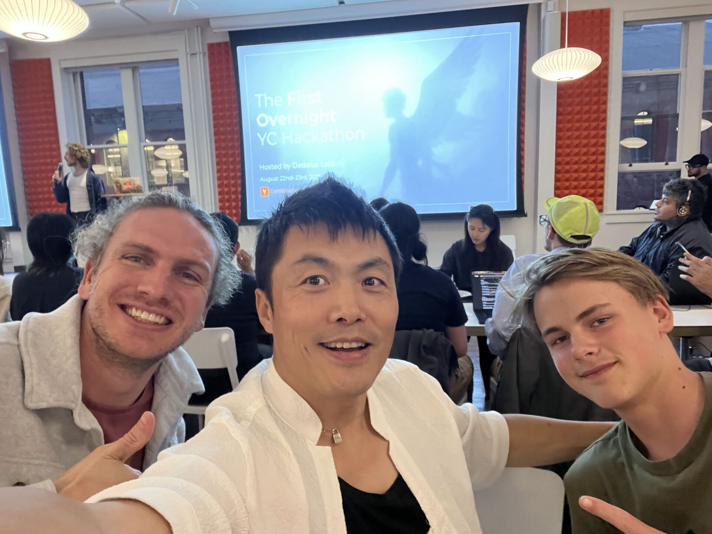

# ReMic 🎙️🔊  
**Real-time bilingual conversation translator (Web PWA) with style filters**  
YC Agents Hackathon (Aug 22–23, 2025) @ Y Combinator HQ

## Pitch (90 seconds)

Hi, I’m Huan. My mom loves making friends in the U.S., but she doesn’t speak English. Phone translators help, but they’re clunky—you lose the moment.
This is ReMic. One toggle, one button. Two people speak their own languages; each hears the other in near real time—natural, styled, fluent.
It’s powered by realtime multimodal LLM streaming with a twist: **style filters** that adapt tone (*YC Pitch*, *Neutral Pro*, *Warm & Slow*).
Live demo: Person A speaks English → Person B’s phone / earbuds whisper Mandarin. Person B replies in Mandarin → Person A hears styled English. No phone hand‑offs.
We **pivoted during the hackathon** from a native Swift iOS prototype to a **pure Web PWA at https://remic.vercel.app** so anyone can install it instantly (Add to Home Screen) and pair via QR code.
We built low-latency streaming, bilingual routing logic, session pairing (QR), transcripts, and style presets—within 24 hours.
Who’s it for? Immigrants, clinics, schools, local businesses.
Why now? Realtime multimodal models + WebRTC/WebAudio now make sub‑2s bilingual turns achievable in the browser.
Next: group diarization and shared phrasebooks.
ReMic brings back the human part of conversation—with one toggle and one button. Thank you.


## 🚀 Overview

**ReMic** solves a simple but painful problem:  
Immigrants struggle with in-person conversations because existing translation apps are clunky and break the flow.  

**ReMic** makes it natural again:
- One toggle, one button (push-to-talk or auto‑VAD in stretch).  
- **Each participant hears the other’s speech translated & style‑rephrased in their own language** (earbuds or device speaker).  
- **Style filters** (e.g., *YC Pitch*, *Neutral Pro*, *Warm & Slow*) adapt tone to context.  
- **Web install (PWA)**: open URL → “Add to Home Screen” → feels native.  
- **QR pairing**: First user creates a session, second scans to join.  

---

## ✨ Hackathon Narrative (Pivot)

- **Problem:** Existing translators force awkward turn‑taking & device passing; the emotional flow breaks.  
- **Insight:** Modern browsers + realtime LLMs can give “just wear your earbuds and talk” without an app store install.  
- **Solution:** A browser‑installable PWA that pairs two phones, streams audio to realtime multimodal models, and plays back styled translations quickly.  
- **Demo:** Two‑way bilingual conversation live; style filter toggled mid‑flow to show tone shift.  
- **Who benefits:** Immigrants (daily social), clinics, schools, local businesses.  
- **Why now:** Realtime multimodal LLM APIs + WebRTC + WebAudio maturity + universal phone browsers.  

---

## 🛠️ Tech Stack (Current Web PWA)

- **Framework:** Next.js 14 (App Router), React 18, TypeScript, Tailwind CSS  
- **PWA:** Web App Manifest + Service Worker (shell caching, install prompt)  
- **Realtime Model:** OpenAI Realtime (WebRTC / WebSocket) for streaming audio ↔ transcripts ↔ translated speech  
- **Audio Capture/Playback:** MediaDevices getUserMedia + Web Audio API (optional VAD)  
- **Session Pairing:** Short session ID + QR code link (e.g. `https://remic.app/j/AC7FQ2`)  
- **Signaling / Presence:** Lightweight WebSocket (style sync, presence, optional transcript sharing)  
- **Security:** Ephemeral server‑issued model tokens (Edge function) so API key not shipped to client  
- **State:** Client local (React state) + minimal server KV / in‑memory for sessions  
- **Styling:** Tailwind utility classes + accessible components  
- **Metrics:** Latency (mic start → first translated audio), connection status, error counts  

---

## 🎨 UI / UX (Web)

**Primary screen (after join):**
- **Session header** (ID + copy/share + QR re-display)  
- **Language & style bar** (auto-detected languages; style chips)  
- **Push-to-talk button** OR auto‑detect (phase 2)  
- **Live status strip:** Listening / Translating / Speaking + latency ms + connection pill  
- **Transcript panel:** timestamped bilingual lines (source | styled translation)  
- **Install hint:** If not installed standalone, subtle “Install ReMic” CTA  

Design goals: **fast, legible, low cognitive load, finger‑friendly**.  

---

## 🎤 Demo Plan (Web PWA)

1. **Install:** Open `remic.app` → Add to Home Screen (shows native‑like launch).  
2. **Session create:** Device A taps “Start Session” → QR appears.  
3. **Join:** Device B scans QR → auto‑joins; presence indicator turns green.  
4. **Conversation:** A speaks English → B hears styled Mandarin (earbuds / speaker) with transcript line.  
5. **Reply:** B speaks Mandarin → A hears styled English.  
6. **Style live switch:** Toggle to *YC Pitch*; next translated reply shows more concise tone.  
7. **Latency callout:** Show measured latency badge (<1.5s target).  
8. **(Optional)** Refresh one device mid‑session to showcase reconnection resilience.  

---

## ⏱️ Build Timeline (Revised for Web Pivot)

- **Fri 6:30–7:30** — Next.js + PWA scaffold (manifest, service worker, base UI)  
- **Fri 7:30–9:30** — Realtime model integration (audio capture → streaming → transcripts + audio out)  
- **Fri 9:30–11:00** — Session create/join + QR + presence WebSocket  
- **Fri 11:00–12:30** — Style filters prompt shaping + transcript panel  
- **Sat 12:30–1:30** — Latency metrics + reconnect logic + polish  
- **Sat AM** — Install UX refinement, accessibility, offline shell  
- **Sat PM** — Final latency tuning, record backup demo, rehearsal  

---

## 🔑 Style Presets (MVP)

- **YC Pitch** — Concise, confident, energetic; no hedging  
- **Neutral Pro** — Clear, natural, professional cadence  
- **Warm & Slow** — Kind tone, slower pacing, simple wording  

---

## 📱 Devices & Setup (Web)

- 2 × Smartphones (iOS Safari + Android Chrome OR two iPhones)  
- Optional: 2 × Earbuds (each participant wears one pair)  
- Dev laptop (observability / fallback)  
- Network: venue Wi-Fi (hotspot fallback)  
- Camera for recording backup demo  

---

## 📊 Metrics

- **Latency target:** <1.5s (speech start → first translated audio)  
- **Displayed:** median session latency, connection state  
- **Logged (local / dev):** mic_start, first_partial, first_audio_out, errors  
- **Stretch:** 80th percentile & packet loss estimate (if WebRTC)  

---

## ⚖️ Hackathon Rules Compliance

- Repo initialized **after hackathon start (6:30 PM, Aug 22)**  
- All commits public; no pre-existing code used  
- >⅔ of submission built during event  
- Public repo required for judging  
- Backup demo video recorded in case of Wi-Fi issues  

---

## 🙋 Team



- **Lead:** Huan Li (@huan) – Builder, coder, founder
- **Designer & Frontend:** Oliver Cingl - Founder, hacker, builder
- **Open roles:** 1 × Designer (UI/UX polish), optional 1 × Audio/WebRTC wrangler  

---

## 📽️ Backup Demo Video

- 90s clip showing:  
  - EN→ZH translation to AirPods  
  - ZH→EN translation to phone speaker  
  - Style filter switch (YC Pitch)  

---

## 🧭 Future Directions

- Multi-speaker diarization (group conversations)  
- User-trained voice cloning (output matches speaker’s own voice)  
- Phrasebook shortcuts & saved style macros  
- Enterprise dashboards (clinics, schools)  
- On‑device partial translation fallback (edge WASM)  
- Data privacy modes (no transcript persistence)  

---

## 🧩 Architecture (MVP Overview)

```
 ┌────────────┐        create/join         ┌────────────────┐
 │  Browser A │ ─────────────────────────▶ │  Session API   │─┐
 │ (PWA)      │ ◀──────── session/meta ─── │ (Edge / KV)    │ │
 └─────┬──────┘                           └────────────────┘ │
    │  WebRTC / WS (audio+events)                               │
    │                                                           │
    ▼                                                           │
  OpenAI Realtime  ◀── ephemeral token (short‑lived) ──────────────┘
    ▲
    │ (mirror flow for Browser B)
 ┌─────┴──────┐
 │  Browser B │
 └────────────┘
```

**Key simplification:** Each participant maintains *its own* realtime model session. We do *not* forward raw peer audio; we stream locally to the model and receive translations back—reducing signaling complexity & risk during hackathon.

---

## 🔐 Security & Privacy (MVP)

- Ephemeral model access tokens (short TTL)  
- No persistent storage of raw audio  
- Transcripts held client-side (optional share)  
- HTTPS only (required for mic + install)  
- Planned CSP hardening (post‑MVP)  

---

## 🧪 Local Dev

Install deps & run:

```
npm install
npm run dev
```

Open `http://localhost:3000`.

---

## ❓ FAQ (Early)

**Why web instead of native?** Faster distribution (no TestFlight/App Store), device-agnostic, immediate iteration.  
**What about AirPods routing?** Browser controls are limited; we rely on OS default output (earbuds if connected).  
**Will this scale to groups?** Yes—needs diarization & multi-stream mixing; deferred until after stable 1:1 MVP.  
**Why separate model sessions per user?** Simplifies latency & failure isolation; no cross‑device raw audio pipeline needed initially.  

---

## Alternative Products

- [Review: Waverly Labs Ambassador Interpreter](https://www.wired.com/review/waverly-labs-ambassador-interpreter/)
- [Review: Waverly Labs Forum](https://www.wired.com/review/waverly-labs-forum/)

The concept is simple. Everyone in the group launches the app, and the “leader” of the group—ideally the person that will be doing most of the speaking—initiates a session as the host. Everyone else joins the session either by scanning a provided QR code or tapping in a six-digit number, essentially joining a group chat. All supported languages, 25 at present, are translated in real time within the app to every member of the session. Since it’s all on an app, you can be in the same room or (more usefully) scattered around the globe.

While Forum is optimally designed for presentations or group meetings where one person is doing most of the talking and the bulk of the other session members are mostly listening in silence, it doesn’t have to work that way. Any number of participants can actively speak in their own language and have their comments translated for the group, each receiving a different translated language. 25 people could be speaking in 25 different languages, and the app will translate them all into each listener’s chosen tongue, in both text and voice, as selected.

---

## 📜 License

TBD

---

## 🙏 Credits

- OpenAI Realtime API  
- Anthropic, Vercel, Convex, Vapi (hackathon sponsors)  
- YC Agents Hackathon organizers  

---

_This README reflects the pivot (Aug 22, 2025) from native iOS to a web-first PWA architecture._

---
